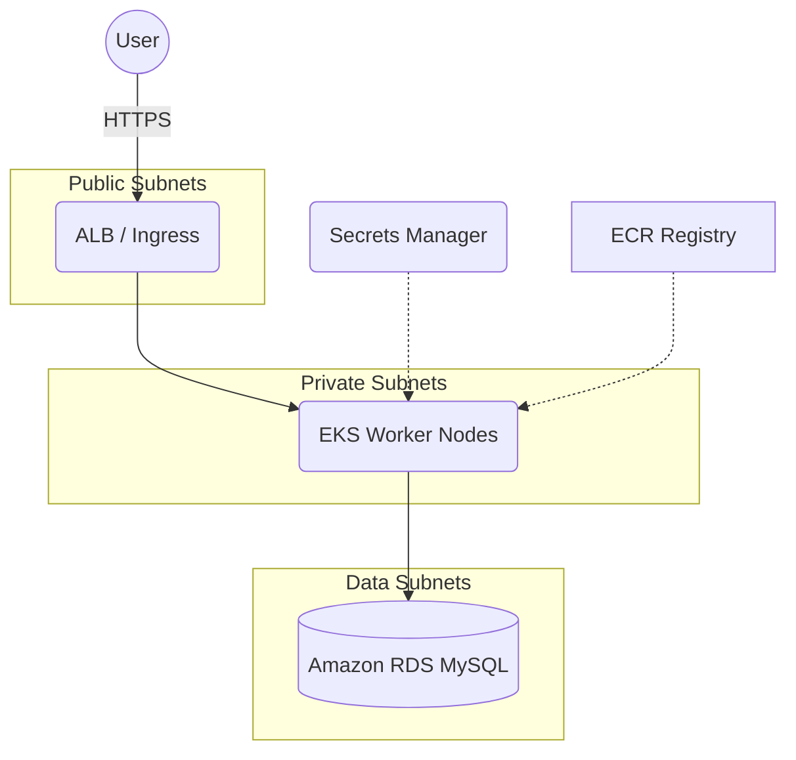

# Dynamic LAMP Stack Website on AWS

Host a production‑ready, container‑based LAMP (Linux, Apache, MySQL, PHP) application on Amazon Web Services using a modern, secure, and highly available architecture.

---

## 🚀 Project Highlights

- **Version‑control everything** – Store IaC templates, Dockerfile, and Kubernetes manifests in a GitHub repository for repeatable deployments.
- **Segment traffic with a 3‑Tier VPC** – Isolate public, private, and data subnets to meet strict security standards.
- **Containerize the application** – Build the website into a Docker image and push it to **Amazon ECR** for fast, regional pulls.
- **Protect secrets** – Keep database credentials in **AWS Secrets Manager** and mount them into Pods at runtime.
- **Automate schema migrations** – Run Flyway from an **EC2 Instance Connect** bastion to seed the **Amazon RDS** MySQL instance.
- **Orchestrate with Kubernetes** – Deploy the workload to an **Amazon EKS** control plane with managed worker nodes.
- **Blueprint deployments** – Apply declarative Kubernetes YAML manifests for Deployments, Services, Ingress, and ConfigMaps/Secrets.
- **Expose the site globally** – Point a custom domain in **Route 53** to the public Application Load Balancer fronting the EKS Ingress.

---

## 🛰️ Architecture Overview



---

## 🛠️ Key AWS Services

| Layer              | Service                         | Purpose                                         |
| ------------------ | ------------------------------- | ----------------------------------------------- |
| Networking         | VPC, Subnets, Route Tables, IGW | 3‑tier segmentation & internet egress           |
| Compute            | Amazon EKS, EC2 (bastion)       | Container orchestration & secure administration |
| Database           | Amazon RDS (MySQL 8)            | Relational data store                           |
| Container Registry | Amazon ECR                      | Versioned Docker image storage                  |
| Secrets            | AWS Secrets Manager             | Encrypted storage for DB creds                  |
| DNS                | Amazon Route 53                 | Public DNS and domain management                |

---

## 📋 Prerequisites

- AWS account with administrative access or fine‑grained IAM roles
- Docker 20.x or later
- AWS CLI v2 configured (`aws configure`)
- kubectl (matching the EKS version)
- eksctl or Terraform for cluster creation
- Git installed and GitHub repository created

---

## ⚙️ Deployment Guide

1. **Clone the repository**
   ```bash
   git clone https://github.com/<YOUR_GH_USERNAME>/<REPO>.git
   cd <REPO>
   ```
2. **Build & push Docker image**
   ```bash
   aws ecr get-login-password --region <REGION> | docker login --username AWS --password-stdin <AWS_ACCOUNT>.dkr.ecr.<REGION>.amazonaws.com
   docker build -t lamp-site:latest .
   docker tag lamp-site:latest <AWS_ACCOUNT>.dkr.ecr.<REGION>.amazonaws.com/lamp-site:latest
   docker push <AWS_ACCOUNT>.dkr.ecr.<REGION>.amazonaws.com/lamp-site:latest
   ```
3. **Provision 3‑Tier VPC & EKS cluster** (choose one):
   - `eksctl create cluster -f infrastructure/eksctl.yaml`
   - _or_ apply Terraform in `infrastructure/terraform/`.
4. **Create & attach worker node group**
   ```bash
   eksctl create nodegroup -f infrastructure/nodegroup.yaml
   ```
5. **Store DB credentials in Secrets Manager**
   ```bash
   aws secretsmanager create-secret \
     --name lamp-mysql-creds \
     --secret-string '{"username":"admin","password":"<STRONG_PW>"}'
   ```
6. **Deploy Kubernetes manifests**
   ```bash
   kubectl apply -f k8s/namespace.yaml
   kubectl apply -f k8s/secret-provider-class.yaml  # ASM/CSI
   kubectl apply -f k8s/deployment.yaml
   kubectl apply -f k8s/service.yaml
   kubectl apply -f k8s/ingress.yaml
   ```
7. **Migrate the database with Flyway**
   ```bash
   ssh -i <KEY>.pem ec2-user@<BASTION_PUBLIC_IP>
   flyway -url=jdbc:mysql://<RDS_ENDPOINT>:3306/<DB_NAME> \
          -user=$(aws secretsmanager get-secret-value --secret-id lamp-mysql-creds --query 'SecretString' --output text | jq -r .username) \
          -password=$(aws secretsmanager get-secret-value --secret-id lamp-mysql-creds --query 'SecretString' --output text | jq -r .password) \
          migrate
   ```
8. **Configure DNS**
   - Note the ALB DNS name from `kubectl get ingress`.
   - In Route 53, create an `A` or `CNAME` record pointing your domain to the ALB address.

After DNS propagation, browse to `https://your‑domain.com` to view the site.

---

## 🔐 Security Notes

- Worker nodes reside in **private subnets**; only the ALB is publicly accessible.
- All traffic uses HTTPS with an ACM TLS certificate terminated at the ALB.
- Secrets never leave AWS KMS‑encrypted storage; they are injected at pod start‑up via the Secrets Store CSI Driver.

---

## 🧹 Clean‑Up

```bash
# Remove Kubernetes resources
kubectl delete -f k8s/
# Delete EKS cluster & node groups
eksctl delete cluster --name <CLUSTER_NAME> --region <REGION>
# Deregister&delete ECR repo if desired
aws ecr delete-repository --force --repository-name lamp-site
# Remove Secrets Manager secret
aws secretsmanager delete-secret --secret-id lamp-mysql-creds --force-delete-without-recovery
```
